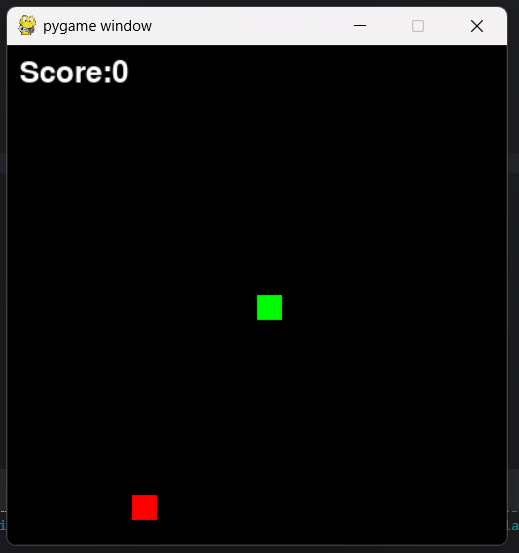

# 🐍 Snake Game

<div align="center">



*A classic Snake game built with Python and Pygame*

[](https://python.org)
[](https://pygame.org)

</div>

---

## 🎮 About

A fully functional Snake game implementation using Python and Pygame. Test your reflexes and see how long you can grow your snake!

## ✨ Features

- 🎯 Smooth snake movement controls
- 🍎 Random food spawning
- 📈 Score tracking
- 🚫 Collision detection (walls & self)
- ⏸️ Pause functionality
- 🎨 Clean, minimalist design

## 🕹️ How to Play

1. Use **arrow keys** to control the snake's direction
2. Eat the **red food** to grow and increase your score
3. **Avoid** hitting the walls or yourself
4. Press **ESC** to quit the game

## 🛠️ Installation

```bash
# Clone the repository
git clone https://github.com/yourusername/snake-game.git

# Navigate to the project directory
cd snake-game

# Install dependencies
pip install pygame
```

## 🚀 Running the Game

```bash
python main.py
```

## ⌨️ Controls

| Key | Action |
|-----|--------|
| ↑ | Move Up |
| ↓ | Move Down |
| ← | Move Left |
| → | Move Right |
| ESC | Quit Game |

## 📁 Project Structure

```
Snake-Game/
├── 📄 main.py          # Main game file
├── 📁 assets/
│   └── 🖼️ image.png   # Game screenshot
├── 📄 README.md        # This file
└── 📄 .gitignore       # Git ignore rules
```

## 🤝 Contributing

Contributions are welcome! Feel free to submit a Pull Request.

## 📝 License

This project is open source and available under the [MIT License](LICENSE).

---

<div align="center">

*Made with ❤️ and Python*

</div>